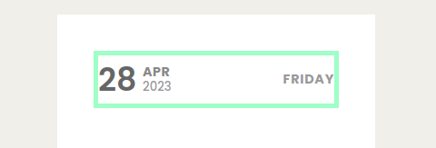
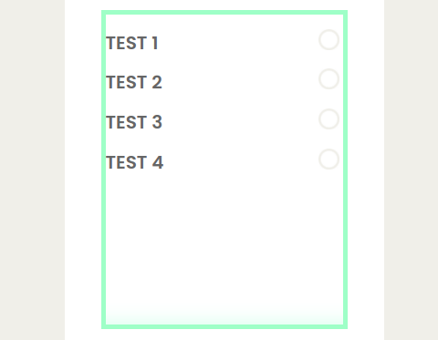
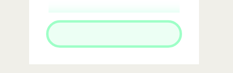

# React-Todo-App

- This is a UI for a To-do App built using React.
- The setup for creating the React app is done using Webpack.
- The UI is built using React components : class component, stateless component and functional component with hooks.
- Here, the data is static and is being passed to the list from the `ListData.jsx` file.
- Live demonstration : [Todo App](https://production--react-practicl-3.netlify.app/)

---

## Tech Stack

- The website is built with famous web development tools, they are mentioned below:
  [](https://skillicons.dev)

---

## Class components

- A class component is a more featured way to define a React component.
- It also acts like a function that receives props, but that function also considers a private internal state as additional input that controls the returned JSX.
- Class component can be created using the class keyword, and it extends the React.Component class.

---

## Functional components

- Functional components are just javascript functions, which contains some logic to perform certain actions.
- These components accept the data as props and return the React element which is nothing HTML content.
- With introduction to the React 16, writing functional components is the standard way of creating components in modern react applications.

---

## Hooks

- Hooks allow function components to have access to state and other React features.
- Hooks allow us to "hook" into React features such as state and lifecycle methods.
- There are 3 rules for hooks:
  1. Hooks can only be called inside React function components.
  2. Hooks can only be called at the top level of a component.
  3. Hooks cannot be conditional

#### file structure Like this

```
TO-DO-LIST(WORKING)/
├── node_modules
├── src/
|   ├──assets/
|   ├──component/
|          ├── AddUserInput/
│                   ├── AddInput.tsx
│                   ├── AddInput.css
|          ├── DateAndTime/
│                   ├── DayAndDate.tsx
│                   ├── DayAndDate.css
|          ├── ToDoItemList/
│                   ├── ToDoList.tsx
│                   ├── ToDoList.css
|          ├── ToDoSingleItem/
│                   ├── ToDoSingleItem.tsx
│                   ├── ToDoSingleItem.css
|          └── Ui/
│                   ├── card.css
│                   ├── Card.tsx
│                   ├── CardComponent.tsx
|   ├──context/
│          ├── Context.tsx
|   ├──hooks/
│          ├── usegetTime.tsx
│
│   ├── App.tsx
│   ├── App.css
│   ├── main.tsx
│   ├── index.js
│   └── index.js
├── README.md
├── tsconfig.node.json
├── package-lock.json
├── tsconfig.json
├── package.json
└── vite.config.js
## Components

**1. App**

- `App` the main component that is rendered when the site is loaded.

**2. Card**

- `Card` is the main container that is the body of the todo list.
TO-DO-LIST(WORKING)/
├── src/
|   ├──component/
|          ├── DateAndTime/
│                   ├── DayAndDate.tsx
│                   ├── DayAndDate.css
|          ├── ToDoItemList/
│                   ├── ToDoList.tsx
│                   ├── ToDoList.css

```

# DayAndDate shows Current Day and time which is imported from



# ToDoList shows Current Data

## if there is nothing to show in to list then this Screen will show


## if there is something to show in to list then this Screen will show



```

```

# 4. TaskList\*\*

```
- `TaskList` contains the list of tasks and the checkbox.
- The tasks that are completed are marked as checked.
TO-DO-LIST(WORKING)/
├── src/
|   ├──component/
|          ├── AddUserInput/
│                   ├── AddInput.tsx
│                   ├── AddInput.css
```

## for adding new task



```
- `Card` also has Current Day and time which is imported from
TO-DO-LIST(WORKING)/
├── src/
|   ├──hooks/
│          ├── usegetTime.tsx
```

# 5. AddTaskButton\*\*

```
- `AddTaskButton` contains the button using which we can add new tasks in the todo list.
- Since the data is static here, currently only the tasks that are present in the data can be seen in the list.

```

# TO-DO-APP

This is a simple project that uses Vite as its build tool.

## Installation

To install the project, clone this repository to your local machine:

bash
Copy code
git clone https://github.com/abhishek-simform-v1/REACT-PRACTICAL-3.git
Then, navigate to the project directory and install the dependencies:

## npm install

### Usage

To start the development server, run the following command:

npm start

This will start the server and open the project in your default browser. You can now start editing the files in the src directory, and the browser will automatically reload whenever you make changes.

## To build the project for production, run the following command:

npm run build
This will generate a production-ready build in the dist directory.

# Contributing

If you would like to contribute to this project, please fork the repository and submit a pull request.
live Link
link:- https://to-do-list-simform.netlify.app/

```

```
